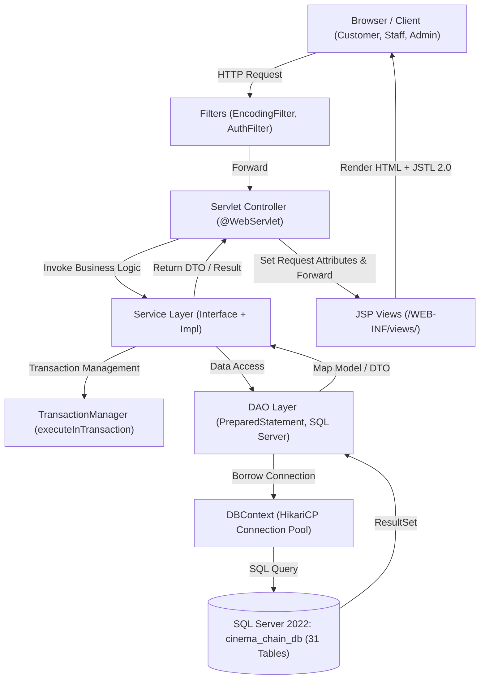
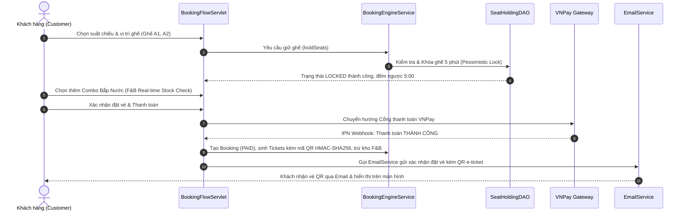
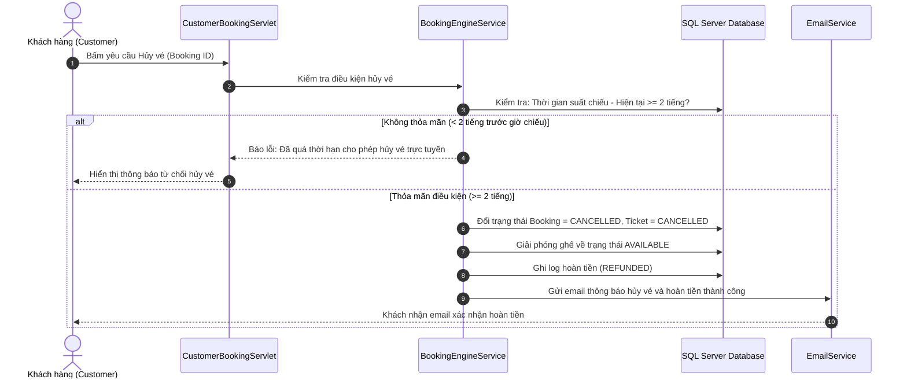
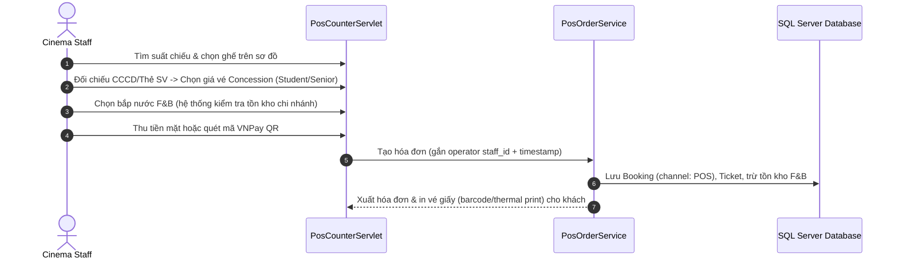
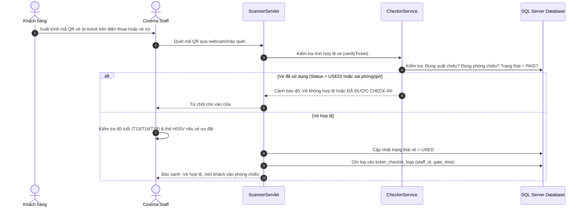
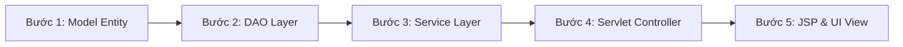

# CINEMAX - HỆ THỐNG QUẢN LÝ CỤM RẠP CHI NHÁNH TOÀN QUỐC
> **DỰ ÁN SWP391 - NHÓM 3 (SE2056-JV)**  
> **Kiến trúc:** Package-by-Feature kết hợp Layered Architecture (DDD-Lite)  
> **Nền tảng công nghệ:** Java 17 LTS | Jakarta EE 10 (Servlet 5.0, JSP 3.0, JSTL 2.0) | **Microsoft SQL Server 2019+** | HikariCP 5.1.0 | Apache Tomcat 10.1.x | Maven

---

## 🧭 MỤC LỤC & TÀI LIỆU HƯỚNG DẪN DÀNH CHO THÀNH VIÊN
1. [Bộ Công Nghệ & Ranh Giới Kỹ Thuật Chuẩn](#1-bộ-công-nghệ--ranh-giới-kỹ-thuật-chuẩn)
2. [Các Quyết Định Nghiệp Vụ Đã Chốt (Feature Tree v2.2)](#2-các-quyết-định-nghiệp-vụ-đã-chốt-feature-tree-v22)
3. [Ma Trận Phân Bổ Task & Sprints (15 – 16 – 13 = 44 Tasks)](#3-ma-trận-phân-bổ-task--sprints-15--16--13--44-tasks)
4. [Tư Duy Kiến Trúc & Luồng Dữ Liệu Lớp (Layered Data Flow)](#4-tư-duy-kiến-trúc--luồng-dữ-liệu-lớp-layered-data-flow)
5. [Các Luồng Nghiệp Vụ Cốt Lõi (Core End-to-End Business Flows)](#5-các-luồng-nghiệp-vụ-cốt-lõi-core-end-to-end-business-flows)
6. [Hướng Dẫn Thành Viên: Bắt Đầu Làm 1 Tính Năng Mới Từ Đâu?](#6-hướng-dẫn-thành-viên-bắt-đầu-làm-1-tính-năng-mới-từ-đâu)
7. [Cấu Trúc Thư Mục Toàn Dự Án (Project Structure Tree)](#7-cấu-trúc-thư-mục-toàn-dự-án-project-structure-tree)
8. [Quy Tắc Viết Code & Bảo Mật Bắt Buộc (Best Practices)](#8-quy-tắc-viết-code--bảo-mật-bắt-buộc-best-practices)
9. [Quy Trình Làm Việc Với Git & Tránh Xung Đột (Zero Conflict)](#9-quy-trình-làm-việc-với-git--tránh-xung-đột-zero-conflict)

---

## 1. BỘ CÔNG NGHỆ & RANH GIỚI KỸ THUẬT CHUẨN

> [!IMPORTANT]
> **LƯU Ý CỐT LÕI VỀ CSDL & THƯ VIỆN:**
> - Dự án sử dụng **MICROSOFT SQL SERVER 2019+** (Không dùng MySQL). Collation khuyến nghị: `Vietnamese_CI_AS`.
> - Chuẩn **Jakarta EE 10 (Tomcat 10.1.x)**: 100% Servlet và Filter đều `import jakarta.servlet.*` (Tuyệt đối **KHÔNG** dùng `javax.servlet.*`).
> - Kết nối cơ sở dữ liệu qua **HikariCP Connection Pool** tập trung tại `DBContext.getConnection()`.
> - Định tuyến Servlet bằng Annotation `@WebServlet`, **tuyệt đối không khai báo Servlet trong `web.xml`** để triệt tiêu nguy cơ xung đột Git merge conflict.

| Hạng mục | Công nghệ sử dụng | Ghi chú kỹ thuật |
| :--- | :--- | :--- |
| **Ngôn ngữ** | Java 17 LTS | JDK 17 bắt buộc cho toàn bộ thành viên |
| **Web Server** | Apache Tomcat 10.1.x | Chuẩn tương thích Jakarta EE 10 / Servlet 5.0 |
| **Cơ sở dữ liệu** | **Microsoft SQL Server 2019 / 2022** | Chạy qua cổng mặc định `1433`, Database: `cinema_chain_db` |
| **JDBC Driver** | `com.microsoft.sqlserver:mssql-jdbc:12.6.1.jre11` | Cấu hình trong `pom.xml` |
| **Connection Pool**| `HikariCP 5.1.0` | Quản lý connection pool tái sử dụng, chống rò rỉ kết nối |
| **Mật mã & Hash** | Salted BCrypt (12 rounds) | Sử dụng qua helper tập trung `PasswordUtil` |
| **Giao diện (UI)** | JSP, JSTL 2.0, Cinema Dark Luxury Theme, Bootstrap 5.3, FontAwesome 6 | Responsive, YouTube Trailer Modal, Poster tỷ lệ 2:3 |
| **Quản lý Build** | Apache Maven 3.8+ | Quản lý dependencies & đóng gói artifact WAR |

---

## 2. CÁC QUYẾT ĐỊNH NGHIỆP VỤ ĐÃ CHỐT (FEATURE TREE v2.2)

Dự án đề cao nghiệp vụ sâu, luồng dữ liệu chuẩn chỉ và tính toàn vẹn (ACID, Concurrency) hơn độ phủ tính năng dàn trải. Toàn bộ 5 thành viên tuân thủ **6 nguyên tắc phạm vi v2.2**:

1. **Xử lý dứt điểm "Vận hành ca" của Cinema Staff:**
   - Hệ thống **KHÔNG** làm phân ca (`Assign Staff Shifts`), mở/đóng két tiền (`Cash Drawer`) hay báo cáo ca riêng lẻ.
   - Doanh số và hóa đơn tại quầy được gắn trực tiếp theo `staff_id` và timestamp của nhân viên thực hiện. Cinema Staff còn đúng **9 Use Case sạch**.
2. **Chặn rủi ro Race Condition & Hoàn tiền ở M-05.4 (Booking Management):**
   - Loại bỏ hoàn toàn tính năng `Modify booking` (sửa ghế/phim sau thanh toán) vì vướng lệch giá và cổng thanh toán.
   - Thay bằng quy tắc chuẩn quốc tế: **`Cancel booking (conditional)`** (chỉ cho phép hủy trực tuyến trước giờ chiếu tối thiểu 2 tiếng, tự động kích hoạt hoàn tiền và giải phóng ghế).
3. **Giá vé ưu đãi tại quầy (`Concession Ticket Pricing`):**
   - Không áp dụng mã Voucher hay chiết khấu điểm thưởng.
   - Tại quầy POS, nhân viên áp dụng bảng giá định sẵn (`Standard / Student / Senior`) cấu hình tại M-03.2 khi khách xuất trình thẻ HSSV/CCCD hợp lệ.
4. **Khép kín Tồn kho Bắp nước (F&B Real-time Stock):**
   - Tự động trừ tồn kho (`stock_quantity`) theo thời gian thực ngay khi thanh toán thành công (Online / POS).
   - Tự động kích hoạt trạng thái `Out of Stock` (vô hiệu hóa nút thêm vào giỏ khi tồn kho $\le 0$) chống bán âm kho.
5. **Cắt bỏ hoàn toàn Voucher / Promotion:** Không xây dựng module tạo mã hay nhập mã giảm giá.
6. **Cắt bỏ hoàn toàn Loyalty & Membership Tiers:** Không làm tích điểm, tiêu điểm hay thăng hạng thẻ.

---

## 3. MA TRẬN PHÂN BỔ TASK & SPRINTS (15 – 16 – 13 = 44 TASKS)

Kế hoạch tái cơ cấu giải quyết dứt điểm 3 điểm nghẽn về phụ thuộc dữ liệu và lệch tải:
- **Linh có việc ngay Iteration 1:** Thiết kế DTO và cấu trúc ghế chuẩn bị cho engine giữ chỗ ở Iteration 2.
- **Dũng hoàn thiện Seat Designer ngay Iteration 1:** Làm nền tảng cho Linh ở Iteration 2 render visual map ghế mà không bị nghẽn phụ thuộc chéo.
- **Cường nhận trọn gói module M-09 (Notification):** Tận dụng hạ tầng gửi email OTP từ Iteration 1 để gửi email vé QR và thông báo hoàn hủy ở Iteration 3.
- **Cân bằng tải tối ưu:** $9 - 9 - 9 - 9 - 8$ (Tổng cộng 44 tasks).

### Ma Trận Phân Bổ Tổng Hợp
| Thành viên | Iteration 1 <br> *(Nền tảng & Dữ liệu gốc)* | Iteration 2 <br> *(Lập lịch & Giao dịch lõi)* | Iteration 3 <br> *(Soát vé, Hậu mãi & BI)* | **Tổng Task** |
| :--- | :---: | :---: | :---: | :---: |
| **Dũng (Leader)** | **4** | **3** | **2** | **9** |
| **Thịnh** | **4** | **3** | **2** | **9** |
| **Linh** | **2** | **4** | **3** | **9** |
| **Cường** | **3** | **3** | **3** | **9** |
| **Tuyển** | **2** | **3** | **3** | **8** |
| **TỔNG CỘNG** | **15** | **16** | **13** | **44** |

---

### Danh Sách Chi Tiết 44 Tasks Theo Từng Thành Viên:

#### 1. Dũng — Infrastructure, Seat Architect & BI Reports (9 tasks)
* **Iteration 1 (4 tasks):**
  1. `Branch Management (CRUD)` (M-04.1) — Quản lý chi nhánh cụm rạp toàn quốc.
  2. `Screening Room Management (CRUD)` (M-04.2) — Quản lý phòng chiếu & định dạng 2D/3D/IMAX.
  3. `Seat Layout Designer` (M-04.3) — Thiết kế ma trận ghế (A-Z × 1-N) và loại ghế (Standard/VIP/Couple).
  4. `System Settings` (M-11) — Quản lý tham số toàn cục (holding duration 5m, buffer vệ sinh 15m).
* **Iteration 2 (3 tasks):**
  5. `Admin Dashboard` (M-11) — Tổng quan vận hành hệ thống các rạp.
  6. `Seat Maintenance Toggle` (M-04.3) — Đóng/mở bảo trì ghế hỏng cho Admin & Manager.
  7. `Branch Occupancy Report` (M-10.3) — Báo cáo tỷ lệ lấp đầy phòng chiếu.
* **Iteration 3 (2 tasks):**
  8. `Revenue & Sales Reports` (M-10.1) — Báo cáo doanh thu vé, F&B, phương thức thanh toán.
  9. `Enterprise BI & Comparison Reports` (M-10.2) — So sánh hiệu suất liên chi nhánh, xuất Excel/PDF.

#### 2. Thịnh — Movie Catalog, Showtime Scheduling & Reviews (9 tasks)
* **Iteration 1 (4 tasks):**
  1. `Home Page & Browsing` (M-01.1) — Trang chủ xem phim đang chiếu & sắp chiếu.
  2. `Movie Detail & Trailer` (M-01.1) — Chi tiết phim, trailer, độ tuổi (T13/T16/T18).
  3. `Movie Search & Filter` (M-01.1) — Tìm kiếm theo tên, lọc theo thể loại & độ tuổi.
  4. `Admin Master Movie Catalog (CRUD)` (M-02.1) — Quản lý kho phim toàn chuỗi.
* **Iteration 2 (3 tasks):**
  5. `Showtime Schedule View` (M-01.1) — Lịch chiếu công khai theo rạp và ngày.
  6. `Showtime Creation & Scheduling` (M-03.1) — Manager tạo lịch chiếu (kiểm tra buffer 15 phút).
  7. `Dynamic Pricing Configuration` (M-03.2) — Bảng giá vé tiêu chuẩn & giá ưu đãi đối tượng (HSSV/Senior).
* **Iteration 3 (2 tasks):**
  8. `Customer Movie Review` (M-02.2) — Đánh giá 1–5 sao và bình luận phim.
  9. `Admin Review Moderation` (M-02.2) — Kiểm duyệt, ẩn/xóa bình luận vi phạm.

#### 3. Linh — Booking Engine, Concurrency & Online Payment (9 tasks)
* **Iteration 1 (2 tasks):**
  1. `Seat Selection UI & DTO Engine` (M-05.1) — Giao diện sơ đồ ghế trực quan và DTO cấu trúc ghế.
  2. `Pessimistic Seat Holding Logic` (M-05.3) — Khóa giữ ghế 5 phút chống đặt trùng (Pessimistic Lock).
* **Iteration 2 (4 tasks):**
  3. `Auto-Release Expired Holds` (M-05.3) — Background Job tự động nhả ghế quá 5 phút.
  4. `Online Booking Checkout` (M-05.1) — Tóm tắt đơn hàng vé + combo F&B trước thanh toán.
  5. `VNPay Payment Gateway Integration` (M-06.1) — Tích hợp cổng thanh toán trực tuyến & IPN Webhook.
  6. `E-Ticket QR Code Generation` (M-07.1) — Tự động sinh vé điện tử kèm mã QR HMAC-SHA256 sau thanh toán.
* **Iteration 3 (3 tasks):**
  7. `Customer Booking History` (M-05.4) — Xem lịch sử giao dịch và vé điện tử đã mua.
  8. `Cancel Booking (Conditional)` (M-05.4) — Hủy vé trực tuyến trước giờ chiếu $\ge$ 2 tiếng, tự hoàn tiền & nhả ghế.
  9. `Customer Payment Tracking & E-Invoice` (M-06.3) — Tra cứu trạng thái giao dịch và tải hóa đơn điện tử.

#### 4. Cường — Identity, RBAC & Notification Service (9 tasks)
* **Iteration 1 (3 tasks):**
  1. `User Login` (M-01.2) — Đăng nhập xác thực BCrypt.
  2. `User Register` (M-01.1) — Đăng ký tài khoản kèm xác thực Email OTP.
  3. `User Logout` (M-01.2) — Đăng xuất và hủy phiên làm việc/token an toàn.
* **Iteration 2 (3 tasks):**
  4. `Forgot / Reset Password` (M-01.2) — Quên mật khẩu qua email token 15 phút.
  5. `Customer Profile & Change Password` (M-01.3) — Quản lý hồ sơ cá nhân và đổi mật khẩu.
  6. `Admin User Management` (M-01.4) — Quản lý danh sách tài khoản, khóa/mở tài khoản.
* **Iteration 3 (3 tasks):**
  7. `Admin Role & Branch Assignment` (M-01.4) — Phân quyền và điều chuyển Staff/Manager về chi nhánh rạp.
  8. `Booking & Ticket Notification Service` (M-09.1) — Tự động gửi email xác nhận đặt vé kèm QR e-ticket sau thanh toán.
  9. `Showtime Alert & Refund Notification` (M-09.1, M-09.2) — Gửi email nhắc giờ chiếu và thông báo hoàn tiền/hủy suất chiếu.

#### 5. Tuyển — Concession Catalog, POS Counter Sales & Entry Gate (8 tasks)
* **Iteration 1 (2 tasks):**
  1. `Concession Public Menu` (M-08.2) — Hiển thị danh mục bắp nước, combo công khai.
  2. `Admin F&B Catalog Management` (M-08.1) — Quản lý danh mục món, combo và giá bán toàn hệ thống.
* **Iteration 2 (3 tasks):**
  3. `Branch F&B Inventory Management` (M-08.1) — Quản lý tồn kho rạp, tự động trừ kho và bật cờ Out-of-Stock.
  4. `POS Counter Sales` (M-05.2) — Bán vé và bắp nước tại quầy, chọn giá ưu đãi đối tượng (HSSV/Senior).
  5. `POS Counter Payment & Physical Receipt` (M-06.2) — Thu tiền mặt / quét QR VNPay POS và in hóa đơn/vé quầy.
* **Iteration 3 (3 tasks):**
  6. `QR Ticket Scanner & Check-in` (M-07.2) — Quét mã QR tại cửa phòng chiếu, lật trạng thái USED.
  7. `Gate Age & Concession Eligibility Verification` (M-07.2) — Đối chiếu độ tuổi và giấy tờ HSSV tại cửa soát vé.
  8. `Ticket Reissue / Cancel & Reprint` (M-07.1) — In lại vé mất theo SĐT/mã, xử lý hủy vé sự cố tại quầy.

---

## 4. TƯ DUY KIẾN TRÚC & LUỒNG DỮ LIỆU LỚP (LAYERED DATA FLOW)

Dự án áp dụng mô hình **Package-by-Feature (DDD-Lite)** kết hợp với **Layered Architecture**:



### 3 Nguyên Tắc Kiến Trúc "Sống Còn":
1. **Tuyệt đối KHÔNG gọi chéo DAO giữa các module:**
   - ❌ Sai: `BookingServiceImpl` trực tiếp import và gọi `MovieDAO.findById()`.
   - ✅ Đúng: `BookingServiceImpl` chỉ được gọi qua `MovieService.getMovieById()`. Các DAO chỉ phục vụ nội bộ module của mình.
2. **Tuyệt đối KHÔNG sửa file `web.xml` để khai báo Servlet:**
   - 100% Servlet khai báo bằng Annotation: `@WebServlet(name = "TênServlet", urlPatterns = {"/duong-dan"})`. Tránh 100% rủi ro Git merge conflict.
3. **Mọi thao tác ghi từ 2 bảng trở lên phải bọc trong Transaction:**
   - Khi tạo Đơn hàng (`bookings`), trừ ghế (`seat_holdings`), tạo vé (`tickets`), tạo hóa đơn F&B (`order_items`), bắt buộc phải dùng `TransactionManager.executeInTransaction(...)` để tự động Rollback nếu có lỗi.

---

## 5. CÁC LUỒNG NGHIỆP VỤ CỐT LÕI (CORE END-TO-END BUSINESS FLOWS)

### 🎫 Luồng 1: Khách Đặt Vé Online & Giữ Ghế Thời Gian Thực (M-05, M-06, M-07, M-09)


### 🚫 Luồng 2: Hủy Vé Trực Tuyến Có Điều Kiện (Conditional Cancellation - M-05.4)


### 🍿 Luồng 3: Bán Vé & Bắp Nước Tại Quầy POS (Counter Sales - M-05.2, M-06.2)


### 🚪 Luồng 4: Soát Vé Điện Tử Tại Cửa Phòng Chiếu (Gate Check-in - M-07.2)


---

## 6. HƯỚNG DẪN THÀNH VIÊN: BẮT ĐẦU LÀM 1 TÍNH NĂNG MỚI TỪ ĐÂU?

Khi nhận 1 task trong bảng phân công, hãy thực hiện theo đúng **5 bước chuẩn chỉ**:



1. **Bước 1 (Model):** Kiểm tra hoặc mở rộng entity trong `com.cinema.model` khớp với bảng CSDL.
2. **Bước 2 (DAO):** Mở/tạo DAO trong `com.cinema.modules.<module>.dao`, dùng `PreparedStatement` và `try-with-resources` để truy vấn SQL Server.
3. **Bước 3 (Service):** Định nghĩa Interface và Impl trong `com.cinema.modules.<module>.service`, xử lý logic nghiệp vụ, validation dữ liệu và transaction.
4. **Bước 4 (Servlet):** Tạo controller kế thừa `HttpServlet` với `@WebServlet(urlPatterns = {"..."})`, đọc tham số request, gọi Service và forward ra JSP.
5. **Bước 5 (JSP View):** Tạo file JSP trong `src/main/webapp/WEB-INF/views/`, nhúng `header.jsp` và `footer.jsp`, sử dụng các class của Dark Cinema Luxury Theme.

---

## 7. CẤU TRÚC THƯ MỤC TOÀN DỰ ÁN (PROJECT STRUCTURE TREE)

```
SWP391-Gr3/
├── pom.xml                               # Khai báo dependency Java 17, Tomcat plugin
├── README.md                             # Tài liệu kỹ thuật dự án (File này)
├── Feature_Tree_CineMax_HieuDinh.md      # Single Source of Truth phạm vi nghiệp vụ (v2.2)
├── ProjectTracking_CineMax.xlsx          # Bảng theo dõi tiến độ sprint & 44 tasks chi tiết
└── src/
    └── main/
        ├── java/com/cinema/
        │   ├── common/                   # DÙNG CHUNG TOÀN HỆ THỐNG
        │   │   ├── config/               # DatabaseConfig.java (Đọc properties)
        │   │   ├── constant/             # Hằng số (Role, BookingStatus, ErrorCode)
        │   │   ├── context/              # DBContext.java (HikariCP Connection Pool)
        │   │   ├── dto/                  # ApiResponse.java, PageResult.java
        │   │   ├── filter/               # EncodingFilter, AuthFilter, RoleFilter
        │   │   ├── transaction/          # TransactionManager.java (Quản lý commit/rollback)
        │   │   └── util/                 # PasswordUtil (BCrypt), DateTimeUtil, ValidationUtil
        │   │
        │   ├── model/                    # 31 ENTITIES TƯƠNG ỨNG 31 BẢNG DATABASE
        │   │   ├── User.java, Movie.java, Showtime.java, Booking.java, Ticket.java...
        │   │
        │   └── modules/                  # 5 BOUNDED CONTEXT THEO 5 THÀNH VIÊN
        │       ├── infrastructure/       # [Dũng] Cụm rạp, Phòng chiếu, Sơ đồ ghế, BI
        │       ├── catalog/              # [Thịnh] Phim, Thể loại, Suất chiếu, Bảng giá, Review
        │       ├── booking/              # [Linh] Giữ ghế 5m, Đặt vé, VNPay, QR e-ticket, Hủy vé
        │       ├── identity/             # [Cường] Đăng nhập, Đăng ký, Profile, Mail OTP, Notification M-09
        │       └── operation/            # [Tuyển] F&B Menu, Tồn kho rạp, POS Counter, QR Scanner
        │
        ├── resources/
        │   ├── db.properties             # Cấu hình kết nối Microsoft SQL Server 2022
        │   └── sql/                      # 3 SCRIPT KHỞI TẠO CSDL CHUẨN UTF-8
        │       ├── 01_schema.sql         # 31 Bảng DDL 3NF (T-SQL)
        │       ├── 02_seed_master_data.sql # Dữ liệu danh mục gốc hệ thống
        │       └── 03_seed_sample_data.sql # Dữ liệu mẫu phim, rạp, ghế, suất chiếu
        │
        └── webapp/
            ├── index.jsp                 # Điều hướng tự động về trang chủ (/home)
            ├── assets/
            │   ├── css/style.css         # Midnight Luxury Cinema Dark Theme (#07090E, #E50914)
            │   └── js/main.js            # Điều khiển Trailer Modal YouTube, Auto-filter
            └── WEB-INF/
                ├── web.xml               # Chỉ cấu hình filter & session (KHÔNG khai báo servlet)
                └── views/
                    ├── common/           # Layout dùng chung (header.jsp, footer.jsp)
                    ├── customer/         # Giao diện khách hàng (catalog/, account/, booking/)
                    └── admin/            # Giao diện quản trị (infrastructure/, catalog/, operation/)
```

---

## 8. QUY TẮC VIẾT CODE & BẢO MẬT BẮT BUỘC (BEST PRACTICES)

1. **Chống SQL Injection 100%:** Luôn dùng `PreparedStatement` với dấu hỏi chấm `?`. Tuyệt đối cấm phép cộng chuỗi SQL.
2. **Quản lý đóng tài nguyên:** Luôn dùng cú pháp `try-with-resources` cho `Connection`, `PreparedStatement` và `ResultSet`.
3. **Mã hóa mật khẩu an toàn:** Không lưu mật khẩu plain text. Dùng `PasswordUtil.hashPassword(...)` và `PasswordUtil.checkPassword(...)`.
4. **Không set cứng Content-Type trong Filter dùng chung:** `EncodingFilter` chỉ set encoding UTF-8, không ép `text/html` lên file tĩnh `.css`, `.js`, `.png` để tránh trình duyệt chặn nạp style.

---

## 9. QUY TRÌNH LÀM VIỆC VỚI GIT & TRÁNH XUNG ĐỘT (ZERO CONFLICT)

1. **Nhánh Git thành viên:** Làm việc trên nhánh định danh cá nhân (ví dụ: `DungBD`, `feature/tv3-showtime...`).
2. **Trước khi commit:** Bắt buộc chạy lệnh kiểm tra biên dịch trên máy:
   ```bash
   mvn clean compile
   ```
   Chỉ khi kết quả hiển thị **`BUILD SUCCESS`** mới được commit và push lên GitHub.
3. **Quy tắc commit chuẩn:** `git commit -m "feat(catalog): thêm chức năng tạo lịch chiếu phim"`

---
*Chúc toàn thể nhóm 3 phối hợp hiệu quả và bảo vệ thành công xuất sắc đồ án SWP391!*
