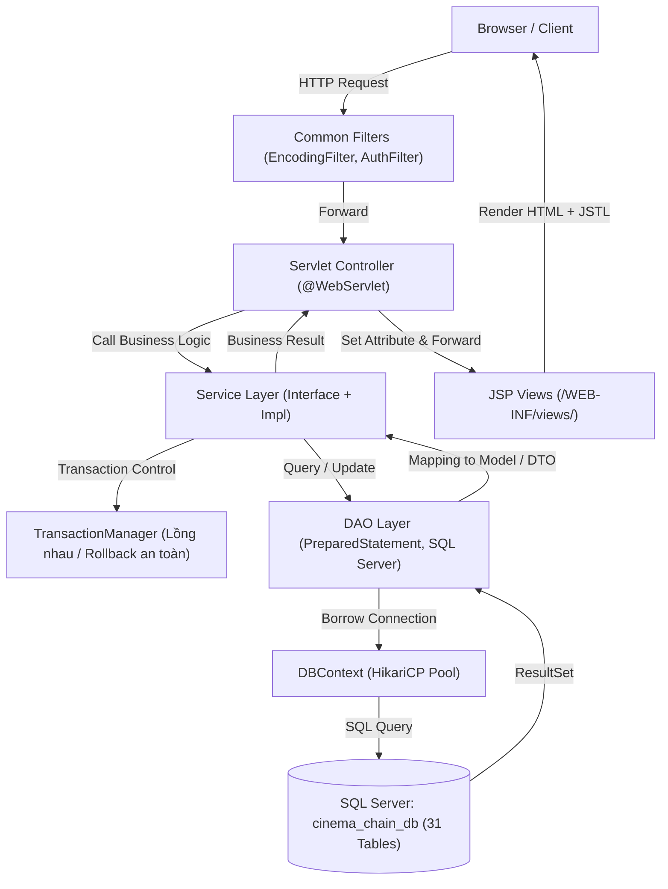
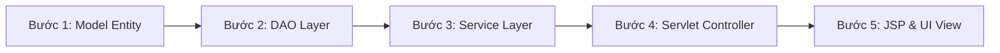

# CINEMAX - HỆ THỐNG QUẢN LÝ CỤM RẠP CHI NHÁNH TOÀN QUỐC
> **DỰ ÁN SWP391 - NHÓM 3 (SE2056-JV)**  
> **Kiến trúc:** Package-by-Feature kết hợp Layered Architecture (DDD-Lite)  
> **Nền tảng công nghệ:** Java 17 LTS | Jakarta EE 10 (Servlet 5.0, JSP 3.0, JSTL 2.0) | **Microsoft SQL Server 2019+** | HikariCP 5.1.0 | Apache Tomcat 10.1.x | Maven

---

## 🧭 MỤC LỤC & TÀI LIỆU DÀNH CHO THÀNH VIÊN
1. [Bộ Công Nghệ & Ranh Giới Kỹ Thuật Chuẩn](#1-bộ-công-nghệ--ranh-giới-kỹ-thuật-chuẩn)
2. [Hướng Dẫn Cài Đặt Môi Trường Từ Đầu (Onboarding Step-by-Step)](#2-hướng-dẫn-cài-đặt-môi-trường-từ-đầu-onboarding-step-by-step)
3. [Tư Duy Kiến Trúc & Luồng Xử Lý (Mental Model & Data Flow)](#3-tư-duy-kiến-trúc--luồng-xử-lý-mental-model--data-flow)
4. [Hướng Dẫn Thành Viên: Bắt Đầu Làm 1 Tính Năng Mới Từ Đâu?](#4-hướng-dẫn-thành-viên-bắt-đầu-làm-1-tính-năng-mới-từ-đâu)
5. [Cấu Trúc Thư Mục Toàn Dự Án (Project Structure Tree)](#5-cấu-trúc-thư-mục-toàn-dự-án-project-structure-tree)
6. [Phân Công 5 Thành Viên & Bảng CSDL Làm Chủ (31 Bảng)](#6-phân-công-5-thành-viên--bảng-csdl-làm-chủ-31-bảng)
7. [Quy Tắc Viết Code & Bảo Mật Bắt Buộc (Best Practices)](#7-quy-tắc-viết-code--bảo-mật-bắt-buộc-best-practices)
8. [Quy Trình Làm Việc Với Git & Tránh Xung Đột (Zero Conflict)](#8-quy-trình-làm-việc-với-git--tránh-xung-đột-zero-conflict)

---

## 1. BỘ CÔNG NGHỆ & RANH GIỚI KỸ THUẬT CHUẨN

> [!IMPORTANT]
> **LƯU Ý CỐT LÕI VỀ CSDL & THƯ VIỆN:**
> - Dự án sử dụng **MICROSOFT SQL SERVER 2019+** (Không dùng MySQL).
> - Sử dụng **Jakarta EE 10 (Tomcat 10.1.x)**: Mọi class đều `import jakarta.servlet.*` (Tuyệt đối **KHÔNG** dùng `javax.servlet.*`).
> - Kết nối cơ sở dữ liệu qua **HikariCP Connection Pool** tập trung tại `DBContext`. Tuyệt đối không tự mở `DriverManager.getConnection()` riêng lẻ.

| Hạng mục | Công nghệ sử dụng | Ghi chú |
| :--- | :--- | :--- |
| **Ngôn ngữ** | Java 17 LTS | Bắt buộc cấu hình JDK 17 trong IDE |
| **Web Server** | Apache Tomcat 10.1.x | Chuẩn tương thích Jakarta EE 10 / Servlet 5.0 |
| **Cơ sở dữ liệu** | **Microsoft SQL Server 2019 / 2022** | Chạy qua cổng mặc định `1433` |
| **JDBC Driver** | `com.microsoft.sqlserver:mssql-jdbc:12.6.1.jre11` | Cấu hình trong `pom.xml` |
| **Connection Pool**| `HikariCP 5.1.0` | Quản lý connection tái sử dụng, chống leak |
| **Mật mã & Hash** | Salted BCrypt (12 rounds) | Sử dụng qua helper `PasswordUtil` |
| **Giao diện (UI)** | JSP, JSTL 2.0, Cinema Dark Theme, Bootstrap 5.3, FontAwesome 6 | Responsive, YouTube Trailer Modal |
| **Quản lý Build** | Apache Maven 3.8+ | Quản lý dependencies & build artifact WAR |

---

## 2. HƯỚNG DẪN CÀI ĐẶT MÔI TRƯỜNG TỪ ĐẦU (ONBOARDING STEP-BY-STEP)

### Bước 1: Chuẩn bị công cụ
- Cài đặt **JDK 17** (Eclipse Temurin 17 hoặc Oracle JDK 17).
- Cài đặt **Microsoft SQL Server** (bản Developer hoặc Express) + **SSMS** (SQL Server Management Studio) hoặc Azure Data Studio / DBeaver.
- Cài đặt **Apache Tomcat 10.1.x** (tải bản zip/installer).
- IDE khuyên dùng: **IntelliJ IDEA Ultimate** hoặc **Eclipse IDE for Enterprise Java and Web Developers**.

---

### Bước 2: Khởi tạo Cơ sở dữ liệu (Microsoft SQL Server)
1. Mở **SSMS** hoặc công cụ quản trị SQL của bạn, kết nối vào SQL Server cục bộ (`localhost` hoặc `.` hoặc `localhost\SQLEXPRESS`).
2. Mở và thực thi (Execute) lần lượt **3 file SQL** theo đúng thứ tự trong thư mục `src/main/resources/sql/`:
   - 📄 **`01_schema.sql`**: Tạo database `cinema_chain_db` và 31 bảng dữ liệu chuẩn 3NF có ràng buộc khóa ngoại (Foreign Keys).
   - 📄 **`02_seed_master_data.sql`**: Nạp dữ liệu danh mục tĩnh hệ thống (Roles, Membership Tiers, Seat Types, Danh mục Thể loại, Rạp chiếu mẫu, Tài khoản Admin).
   - 📄 **`03_seed_sample_data.sql`**: Nạp dữ liệu mô phỏng thực tế (Phim mẫu, Suất chiếu, Sơ đồ ghế 400 ghế, Danh mục Bắp nước F&B, Voucher khuyến mãi).

---

### Bước 3: Cấu hình thông tin kết nối Database
Mở file `src/main/resources/db.properties`:
```properties
db.driver=com.microsoft.sqlserver.jdbc.SQLServerDriver
db.url=jdbc:sqlserver://localhost:1433;databaseName=cinema_chain_db;encrypt=true;trustServerCertificate=true
db.username=sa
db.password=123456

# HikariCP Pool Settings
hikari.maximumPoolSize=10
hikari.minimumIdle=2
hikari.idleTimeout=30000
hikari.maxLifetime=1800000
hikari.connectionTimeout=10000
```
> [!TIP]
> Nếu mật khẩu SQL Server trên máy bạn khác `123456`, hãy tạo file `src/main/resources/db.local.properties` (file này đã được ignore trong git) và cấu hình username/password máy bạn vào đó để không làm xung đột git với các bạn khác.

---

### Bước 4: Kiểm tra biên dịch Maven
Mở terminal tại thư mục gốc `SWP391-Gr3` và chạy:
```bash
mvn clean compile
```
Đảm bảo kết quả hiển thị **`BUILD SUCCESS`** trước khi chạy server.

---

### Bước 5: Cấu hình chạy trên Tomcat 10.1 trong IDE
1. Trong IntelliJ IDEA:
   - Vào menu `Run` -> `Edit Configurations...` -> Bấm dấu `+` -> Chọn `Tomcat Server` -> `Local`.
   - Cấu hình Application server trỏ tới thư mục Tomcat 10.1 của bạn.
   - Chuyển sang tab **Deployment**: Bấm `+` -> Chọn `Artifact...` -> Chọn `SWP391-Gr3:war exploded`.
   - Đặt **Application context** là: `/` (hoặc để trống, hoặc `/SWP391-Gr3`). Khuyên dùng `/` để đường dẫn ngắn gọn.
   - Bấm **Apply** và nhấn **Run/Debug** (Shift + F10).
2. Kiểm tra trên trình duyệt:
   - Trang chủ: `http://localhost:8080/home` (hoặc `http://localhost:8080/`)
   - Danh sách phim & bộ lọc: `http://localhost:8080/movies`
   - Chi tiết phim: `http://localhost:8080/movie/detail?id=1`
   - Đăng nhập: `http://localhost:8080/auth/login`

---

### Danh sách tài khoản kiểm thử có sẵn
> **Mật khẩu mặc định cho toàn bộ tài khoản:** `123456`

| Email Đăng Nhập | Họ & Tên | Vai Trò (Role) | Phạm vi chi nhánh | Mục đích test |
| :--- | :--- | :--- | :--- | :--- |
| `admin@cinema.com` | Quản Trị Hệ Thống | **ADMIN** | Toàn hệ thống | Quản trị cụm rạp, tài khoản, cấu hình toàn cục |
| `manager.hn@cinema.com`| Quản Lý Hà Nội | **MANAGER** | Vincom Bà Triệu (HN) | Quản lý phòng chiếu, lên lịch suất chiếu chi nhánh |
| `staff.hn@cinema.com` | Thu Ngân Hà Nội | **STAFF** | Vincom Bà Triệu (HN) | Quầy vé POS, bán vé trực tiếp, soát vé QR |
| `customer@gmail.com` | Khách Hàng Thân Thiết | **CUSTOMER** | Mua vé Online | Đặt vé xem phim, giữ ghế, tích điểm VIP, áp voucher |

---

## 3. TƯ DUY KIẾN TRÚC & LUỒNG XỬ LÝ (MENTAL MODEL & DATA FLOW)

Dự án áp dụng mô hình **Package-by-Feature (DDD-Lite)** kết hợp với **Layered Architecture**. Thay vì gom toàn bộ servlet vào 1 folder chung, code được chia theo từng miền nghiệp vụ (**Bounded Context**) độc lập:



### 3 Nguyên tắc "Sống còn" để không làm hỏng dự án:
1. **Tuyệt đối KHÔNG gọi chéo DAO giữa các module:**
   - ❌ Sai: `BookingServiceImpl` trực tiếp import và gọi `MovieDAO.findById()`.
   - ✅ Đúng: `BookingServiceImpl` chỉ được gọi qua `MovieService.getMovieById()`. Các DAO chỉ phục vụ nội bộ module của mình.
2. **Tuyệt đối KHÔNG sửa file `web.xml` để khai báo Servlet:**
   - 100% Servlet khai báo bằng Annotation: `@WebServlet(name = "TênServlet", urlPatterns = {"/duong-dan"})`. Điều này giúp tránh 100% tình trạng Git merge conflict khi nhiều bạn cùng làm.
3. **Mọi thao tác ghi từ 2 bảng trở lên phải bọc trong Transaction:**
   - Khi tạo Đơn hàng (`bookings`), trừ ghế (`seat_holdings`), tạo vé (`tickets`), tạo hóa đơn F&B (`order_items`), bắt buộc phải dùng `TransactionManager.executeInTransaction(...)` để đảm bảo nếu xảy ra lỗi giữa chừng thì dữ liệu tự động Rollback, không để lại rác trong database.

---

## 4. HƯỚNG DẪN THÀNH VIÊN: BẮT ĐẦU LÀM 1 TÍNH NĂNG MỚI TỪ ĐÂU?

Khi được giao 1 công việc (Ví dụ: *"Làm trang Quản lý Suất chiếu cho Quản lý rạp"*), hãy đi theo **5 bước tuần tự chuẩn chỉ** sau:



### Bước 1: Khảo sát Model Entity (`com.cinema.model`)
- Xem bảng CSDL tương ứng trong SQL (ví dụ: bảng `showtimes`).
- Mở class Model tương ứng trong package `com.cinema.model` (ví dụ: `Showtime.java`).
- Kiểm tra các trường dữ liệu, kiểu dữ liệu, các getters/setters và constructor.

### Bước 2: Viết DAO (`com.cinema.modules.<module>.dao`)
- Mở hoặc tạo Interface DAO (ví dụ: `ShowtimeDAO.java`).
- Viết câu truy vấn SQL Server bằng `PreparedStatement` để chống tấn công **SQL Injection**.
- Mẫu lấy Connection chuẩn:
  ```java
  String sql = "SELECT * FROM showtimes WHERE cinema_id = ? AND status = 'ACTIVE'";
  try (Connection conn = DBContext.getConnection();
       PreparedStatement ps = conn.prepareStatement(sql)) {
      ps.setLong(1, cinemaId);
      try (ResultSet rs = ps.executeQuery()) {
          while (rs.next()) {
              // Map dữ liệu từ rs vào Object Model
          }
      }
  } catch (SQLException e) {
      // Log lỗi rõ ràng
      e.printStackTrace();
  }
  ```

### Bước 3: Viết Service (`com.cinema.modules.<module>.service`)
- Định nghĩa interface nghiệp vụ trong `ShowtimeService.java` và cài đặt trong `impl/ShowtimeServiceImpl.java`.
- Tầng này chịu trách nhiệm:
  - Kiểm tra tính hợp lệ dữ liệu (Validate: thời gian chiếu không được trùng, phòng chiếu đang rảnh...).
  - Gọi DAO để thao tác DB.
  - Sử dụng `TransactionManager` nếu có thao tác ghi phức tạp.

### Bước 4: Viết Servlet Controller (`com.cinema.modules.<module>.controller`)
- Tạo Servlet và gắn annotation URL:
  ```java
  @WebServlet(name = "ShowtimeServlet", urlPatterns = {"/admin/showtimes", "/admin/showtimes/create"})
  public class ShowtimeServlet extends HttpServlet {
      private final ShowtimeService showtimeService = new ShowtimeServiceImpl();

      @Override
      protected void doGet(HttpServletRequest req, HttpServletResponse resp) throws ServletException, IOException {
          // 1. Đọc tham số từ request (request.getParameter)
          // 2. Gọi Service lấy dữ liệu
          // 3. Đưa dữ liệu vào request: req.setAttribute("showtimes", list);
          // 4. Forward sang trang JSP:
          req.getRequestDispatcher("/WEB-INF/views/admin/catalog/showtimes.jsp").forward(req, resp);
      }

      @Override
      protected void doPost(HttpServletRequest req, HttpServletResponse resp) throws ServletException, IOException {
          // Xử lý Form submit -> Gọi Service -> Redirect
          resp.sendRedirect(req.getContextPath() + "/admin/showtimes?success=1");
      }
  }
  ```

### Bước 5: Viết Giao diện JSP (`src/main/webapp/WEB-INF/views/`)
- Mọi trang JSP phải nằm trong `WEB-INF/views/` để đảm bảo bảo mật (người dùng không được gõ trực tiếp `.jsp` trên URL mà bắt buộc phải đi qua Servlet).
- Cấu trúc file JSP chuẩn:
  ```jsp
  <%@ page contentType="text/html;charset=UTF-8" language="java" %>
  <%@ taglib prefix="c" uri="jakarta.tags.core" %>
  <%@ taglib prefix="fmt" uri="jakarta.tags.fmt" %>

  <!-- Nhúng Header dùng chung -->
  <jsp:include page="/WEB-INF/views/common/header.jsp">
      <jsp:param name="pageTitle" value="Quản Lý Suất Chiếu - CineMax" />
  </jsp:include>

  <!-- NỘI DUNG CHÍNH CỦA TRANG (Không cần thẻ <html> hoặc <body> vì Header/Footer đã có) -->
  <main class="container py-4">
      <h2 class="text-white mb-4">Danh Sách Suất Chiếu</h2>
      <table class="table table-dark table-hover">
          <thead>
              <tr>
                  <th>Tên Phim</th>
                  <th>Phòng Chiếu</th>
                  <th>Giờ Chiếu</th>
              </tr>
          </thead>
          <tbody>
              <c:forEach items="${showtimes}" var="st">
                  <tr>
                      <td>${st.movieTitle}</td>
                      <td>${st.roomName}</td>
                      <td>${st.startTime}</td>
                  </tr>
              </c:forEach>
          </tbody>
      </table>
  </main>

  <!-- Nhúng Footer dùng chung -->
  <jsp:include page="/WEB-INF/views/common/footer.jsp" />
  ```

---

## 5. CẤU TRÚC THƯ MỤC TOÀN DỰ ÁN (PROJECT STRUCTURE TREE)

```
SWP391-Gr3/
├── pom.xml                               # Khai báo dependency, compiler Java 17, Tomcat plugin
├── README.md                             # Tài liệu kỹ thuật dự án (File này)
└── src/
    └── main/
        ├── java/com/cinema/
        │   ├── common/                   # DÙNG CHUNG TOÀN HỆ THỐNG
        │   │   ├── config/               # DatabaseConfig.java (Đọc properties)
        │   │   ├── constant/             # Hằng số (Role, BookingStatus, ErrorCode)
        │   │   ├── context/              # DBContext.java (HikariCP Connection Pool)
        │   │   ├── dto/                  # ApiResponse.java, PageResult.java
        │   │   ├── filter/               # EncodingFilter, AuthFilter, RoleFilter
        │   │   ├── transaction/          # TransactionManager.java (Quản lý commit/rollback)
        │   │   └── util/                 # PasswordUtil (BCrypt), DateTimeUtil, ValidationUtil
        │   │
        │   ├── model/                    # 31 ENTITIES TƯƠNG ỨNG 31 BẢNG DATABASE
        │   │   ├── User.java, Role.java, Movie.java, Genre.java, Showtime.java,
        │   │   ├── Booking.java, Ticket.java, Seat.java, ScreeningRoom.java, Cinema.java...
        │   │
        │   └── modules/                  # 5 BOUNDED CONTEXT THEO 5 THÀNH VIÊN
        │       ├── infrastructure/       # [TV 1] Cụm rạp, Phòng chiếu, Sơ đồ ghế
        │       ├── identity/             # [TV 2] Đăng ký, Đăng nhập, Google OAuth, Loyalty Point
        │       ├── catalog/              # [TV 3] Quản lý Phim, Thể loại, Suất chiếu, Bảng giá vé
        │       ├── booking/              # [TV 4] Giữ ghế Real-time, Đặt vé, Thanh toán, Voucher
        │       └── operation/            # [TV 5] Quầy bán vé POS, Bắp nước F&B, Soát vé QR
        │
        ├── resources/
        │   ├── db.properties             # Cấu hình chuỗi kết nối Microsoft SQL Server
        │   └── sql/                      # 3 SCRIPT KHỞI TẠO CSDL
        │       ├── 01_schema.sql         # 31 Bảng DDL 3NF (T-SQL)
        │       ├── 02_seed_master_data.sql # Dữ liệu danh mục gốc
        │       └── 03_seed_sample_data.sql # Dữ liệu chạy thử nghiệm
        │
        └── webapp/
            ├── index.jsp                 # Điều hướng về trang chủ (/home)
            ├── assets/
            │   ├── css/style.css         # Dark Cinema Luxury Theme (#0A0E17, #E50914)
            │   └── js/main.js            # Xử lý Trailer Modal, Form filter
            └── WEB-INF/
                ├── web.xml               # Chỉ cấu hình filter & session (KHÔNG khai báo servlet)
                └── views/
                    ├── common/           # Layout dùng chung (header.jsp, footer.jsp)
                    ├── customer/         # Giao diện Khách hàng xem phim & đặt vé
                    │   ├── catalog/      # home.jsp, movies.jsp, movie-detail.jsp
                    │   ├── account/      # login.jsp, register.jsp, profile.jsp
                    │   └── booking/      # seat-selection.jsp, checkout.jsp
                    └── admin/            # Giao diện Quản trị viên, Quản lý & Thu ngân
                        ├── infrastructure/
                        ├── catalog/
                        └── operation/
```

---

## 6. PHÂN CÔNG 5 THÀNH VIÊN & BẢNG CSDL LÀM CHỦ (31 BẢNG)

| STT | Thành Viên | Module Phụ Trách (`modules.*`) | Thư Mục View (`WEB-INF/views/`) | Bảng CSDL Làm Chủ (31 Bảng) |
| :---: | :--- | :--- | :--- | :--- |
| **TV 1** | **Leader - Hạ Tầng & Hệ Thống** | `modules.infrastructure` | `admin/infrastructure/` | `cinemas`, `screening_rooms`, `seat_types`, `seats`, `system_settings`, `maintenance_schedules` |
| **TV 2** | **Xác Thực, Tài Khoản & Loyalty**| `modules.identity` | `customer/account/`, `admin/users/` | `roles`, `membership_tiers`, `users`, `point_histories`, `customer_vouchers`, `notifications` |
| **TV 3** | **Danh Mục Phim & Suất Chiếu** | `modules.catalog` | `customer/catalog/`, `admin/catalog/` | `genres`, `movies`, `movie_genres`, `showtimes`, `ticket_pricings`, `reviews`, `favorite_movies` |
| **TV 4** | **Booking Engine & Thanh Toán** | `modules.booking` | `customer/booking/`, `admin/booking/` | `vouchers`, `seat_holdings`, `bookings`, `tickets`, `order_items`, `payments` |
| **TV 5** | **Vận Hành POS, F&B & Check-in** | `modules.operation` | `admin/operation/` | `fnb_categories`, `fnb_items`, `cinema_inventories`, `ticket_checkin_logs`, `cash_drawers`, `support_tickets` |

---

## 7. QUY TẮC VIẾT CODE & BẢO MẬT BẮT BUỘC (BEST PRACTICES)

1. **Chống SQL Injection 100%:**
   - Tuyệt đối không dùng phép cộng chuỗi SQL: `String sql = "SELECT * FROM users WHERE email = '" + email + "'";` (❌ CẤM).
   - Luôn luôn dùng dấu hỏi chấm `?` trong `PreparedStatement` (✅).
2. **Quản lý đóng tài nguyên:**
   - Luôn sử dụng cú pháp **`try-with-resources`** cho `Connection`, `PreparedStatement`, và `ResultSet` để tránh cạn kiệt Connection Pool.
3. **Mã hóa mật khẩu:**
   - Không lưu mật khẩu dạng Text thuần (Plain Text). Luôn dùng `PasswordUtil.hashPassword(rawPassword)` khi tạo/đổi mật khẩu và `PasswordUtil.checkPassword(rawPassword, hashedPassword)` khi xác thực đăng nhập.
4. **Xử lý tiếng Việt (Encoding UTF-8):**
   - Bộ lọc `EncodingFilter` đã được cấu hình mặc định bắt buộc `UTF-8`. Các file JSP luôn giữ dòng đầu: `<%@ page contentType="text/html;charset=UTF-8" language="java" %>`.

---

## 8. QUY TRÌNH LÀM VIỆC VỚI GIT & TRÁNH XUNG ĐỘT (ZERO CONFLICT)

Để nhóm 5 người làm việc mượt mà, không bao giờ bị đè code của nhau:

1. **Nguyên tắc phân chia nhánh (Git Branches):**
   - Nhánh `main`: Nhánh chạy chính thức, chỉ merge khi có sự đồng ý của Leader.
   - Nhánh của từng thành viên: Đặt tên theo dạng `feature/<tên-bạn>-<tên-chức-năng>` (hoặc nhánh định danh cá nhân như `DungBD`, `ThinhHT-Homepage`...).
2. **Quy trình làm việc hàng ngày:**
   - **Đầu ngày làm việc:** Kéo code mới nhất về nhánh của mình:
     ```bash
     git pull origin main
     ```
   - **Trước khi Commit:** Chạy kiểm tra biên dịch trên máy:
     ```bash
     mvn clean compile
     ```
     Nếu bị lỗi đỏ, phải sửa cho hết lỗi biên dịch rồi mới được commit.
   - **Đẩy code lên GitHub:**
     ```bash
     git add .
     git commit -m "feat(catalog): thêm chức năng tìm kiếm phim theo thể loại"
     git push origin <tên-nhánh-của-bạn>
     ```
3. **Tuyệt đối không đẩy các file sau lên Git (đã nằm trong `.gitignore`):**
   - Thư mục `target/`
   - File cấu hình IDE (`.idea/`, `.vscode/`, `*.iml`)
   - File kết nối cục bộ cá nhân (`db.local.properties`)

---
*Chúc cả nhóm phối hợp hiệu quả và hoàn thành xuất sắc đồ án SWP391!*
